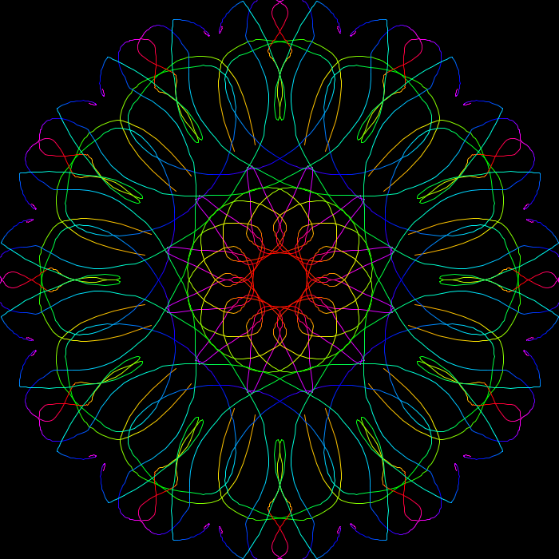
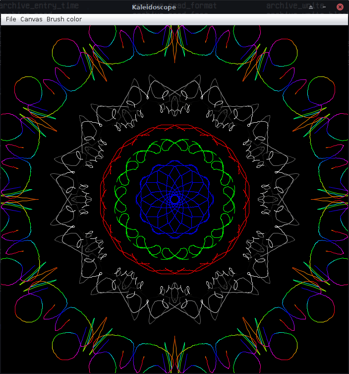
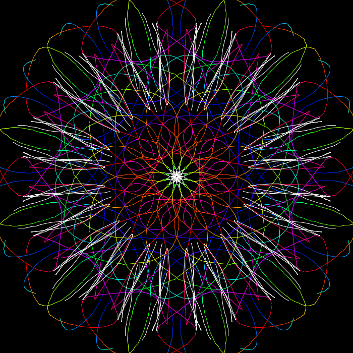

# Kaleidoscope paint
Simple java program for making colorful drawings with [kaleidoscope](https://en.wikipedia.org/wiki/Kaleidoscope) effect

### Compile and run
- You need to have [JDK](https://openjdk.java.net/) first
- Clone the repository `git clone https://github.com/sadracco/kaleidoscope_paint`
- `cd kaleidoscope_paint`
- Compile `javac *.java`
- Run `java Main`

### Screenshots

